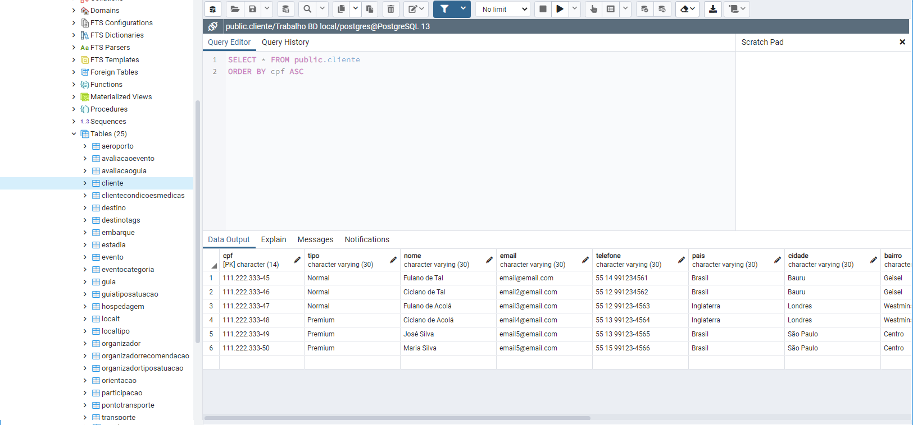
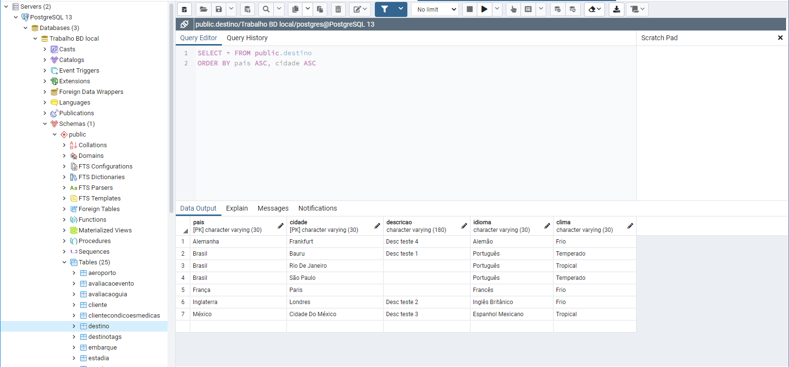

[![Contributors][contributors-shield]][contributors-url]
[![Forks][forks-shield]][forks-url]
[![Stargazers][stars-shield]][stars-url]
[![Issues][issues-shield]][issues-url]
[![MIT License][license-shield]][license-url]
[![LinkedIn][linkedin-shield]][linkedin-url]


<!-- PROJECT LOGO -->
<br />
<p align="center">
  <a href="https://github.com/l-a-motta/trabalho-bd">
    
  </a>

  <h3 align="center">Banco de Dados - Turismo Internacional</h3>

  <p align="center">
    This trabalho-bdsitory is used to keep the SQL files for the creation of a database of a fantasy international tourism company. The focus of this company would be the events of each location that it offers a trip to. The language used for code comments is Brazilian Portuguese.
    <br />
    <a href="https://github.com/l-a-motta/trabalho-bd"><strong>Explore the docs »</strong></a>
    <br />
    <br />
    <a href="https://github.com/l-a-motta/trabalho-bd">View Demo</a>
    ·
    <a href="https://github.com/l-a-motta/trabalho-bd/issues">trabalho-bdrt Bug</a>
    ·
    <a href="https://github.com/l-a-motta/trabalho-bd/issues">Request Feature</a>
  </p>
</p>


<!-- TABLE OF CONTENTS -->
<details open="open">
  <summary><h2 style="display: inline-block">Table of Contents</h2></summary>
  <ol>
    <li>
      <a href="#about-the-project">About The Project</a>
    </li>
    <li>
      <a href="#getting-started">Getting Started</a>
      <ul>
        <li><a href="#prerequisites">Prerequisites</a></li>
        <li><a href="#installation">Local Installation</a></li>
      </ul>
    </li>
    <li><a href="#usage">Usage</a></li>
    <li><a href="#roadmap">Roadmap</a></li>
    <li><a href="#contributing">Contributing</a></li>
    <li><a href="#license">License</a></li>
    <li><a href="#contact">Contact</a></li>
  </ol>
</details>


<!-- ABOUT THE PROJECT -->
## About The Project

<a href="https://app.diagrams.net/#G1cmGM3G4dt-Ci_I8Xf3_cWyz8cWcEQT5G">
    Check out our Draw.io with the Relational Model!
</a>




<!-- GETTING STARTED -->
## Getting Started

To get a local copy up and running follow these simple steps.

### Prerequisites

PostgreSQL 13.2 or newer, PGAdmin 4 or newer.

### Local Installation

1. Clone the trabalho-bd
   ```sh
   git clone https://github.com/l-a-motta/trabalho-bd.git
   ```
2. Open up your PostgreSQL manager (we suggest PGAdmin 4, that comes with a full installation of PostgreSQL already)
   
3. Create a local database to run our .sql files, then open up the Query Tool inside that database

4. Execute our .sql scripts, in the following order: 
    ```limpa.sql 
    esquema.sql
    dados.sql
    ```

5. Now you have a fully populated database! Make sure to always run limpa.sql before the others, so you don't run the risk of leaving some table behind when recreating

6. If you'd like, we also have a few SELECT statements ready to be executed inside consultas.sql


<!-- USAGE EXAMPLES -->
## Usage

Use as you see fit. It's a prepared database with dummy data. We suggest you start trying to add some new tuples with INSERTs before trying anything more complex, like SELECTS.


<!-- ROADMAP -->
## Roadmap

See the [open issues](https://github.com/l-a-motta/trabalho-bd/issues) for a list of proposed features (and known issues).


<!-- CONTRIBUTING -->
## Contributing

Contributions are what make the open source community such an amazing place to be learn, inspire, and create. Any contributions you make are **greatly appreciated**.

1. Fork the Project
2. Create your Feature Branch (`git checkout -b feature/AmazingFeature`)
3. Commit your Changes (`git commit -m 'Add some AmazingFeature'`)
4. Push to the Branch (`git push origin feature/AmazingFeature`)
5. Open a Pull Request


<!-- LICENSE -->
## License

Distributed under the MIT License. See `LICENSE` for more information.


<!-- CONTACT -->
## Contact

Leonardo Antonetti da Motta - [@DaAntonetti](https://twitter.com/@DaAntonetti) - l.a.motta@usp.br

Project Link: [https://github.com/l-a-motta/trabalho-bd](https://github.com/l-a-motta/trabalho-bd)

<!-- MARKDOWN LINKS & IMAGES -->
<!-- https://www.markdownguide.org/basic-syntax/#reference-style-links -->
[contributors-shield]: https://img.shields.io/github/contributors/l-a-motta/trabalho-bd.svg?style=for-the-badge
[contributors-url]: https://github.com/l-a-motta/trabalho-bd/graphs/contributors
[forks-shield]: https://img.shields.io/github/forks/l-a-motta/trabalho-bd.svg?style=for-the-badge
[forks-url]: https://github.com/l-a-motta/trabalho-bd/network/members
[stars-shield]: https://img.shields.io/github/stars/l-a-motta/trabalho-bd.svg?style=for-the-badge
[stars-url]: https://github.com/l-a-motta/trabalho-bd/stargazers
[issues-shield]: https://img.shields.io/github/issues/l-a-motta/trabalho-bd.svg?style=for-the-badge
[issues-url]: https://github.com/l-a-motta/trabalho-bd/issues
[license-shield]: https://img.shields.io/github/license/l-a-motta/trabalho-bd.svg?style=for-the-badge
[license-url]: https://github.com/l-a-motta/trabalho-bd/blob/master/LICENSE.txt
[linkedin-shield]: https://img.shields.io/badge/-LinkedIn-black.svg?style=for-the-badge&logo=linkedin&colorB=555
[linkedin-url]: https://linkedin.com/in/l-a-motta

